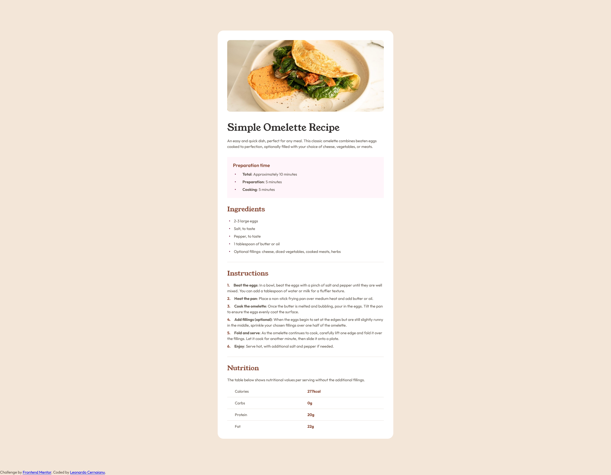

# Frontend Mentor - Recipe page solution

This is a solution to the [Recipe page challenge on Frontend Mentor](https://www.frontendmentor.io/challenges/recipe-page-KiTsR8QQKm). Frontend Mentor challenges help you improve your coding skills by building realistic projects. 

## Table of contents

- [Overview](#overview)
  - [The challenge](#the-challenge)
  - [Screenshot](#screenshot)
  - [Links](#links)
- [My process](#my-process)
  - [Built with](#built-with)
  - [What I learned](#what-i-learned)  
- [Author](#author)

## Overview

### Screenshot

### Links

- Solution URL: [Add solution URL here](https://your-solution-url.com)
- Live Site URL: [Add live site URL here](https://your-live-site-url.com)

## My process

### Built with

- Semantic HTML5 markup
- CSS custom properties
- SCSS
- Flexbox
- CSS Grid

### What I learned

Styling list bullets is very strange. It is easier to use ::before instead of ::marker if you want to closely align the bullet with the text.
Styling tables is very hard, if you have a complicated one (with alignments, spaces, borders etc. that differ between cells/rows/columns). I gave up and used divs with grid. It is easier.
Sometimes, Frontend Mentor forgets to include all the details in the Figma file (like the style of the text in lists or the name of the elements).

## Author

- Frontend Mentor - [@Leonardo76](https://www.frontendmentor.io/profile/Leonardo76)